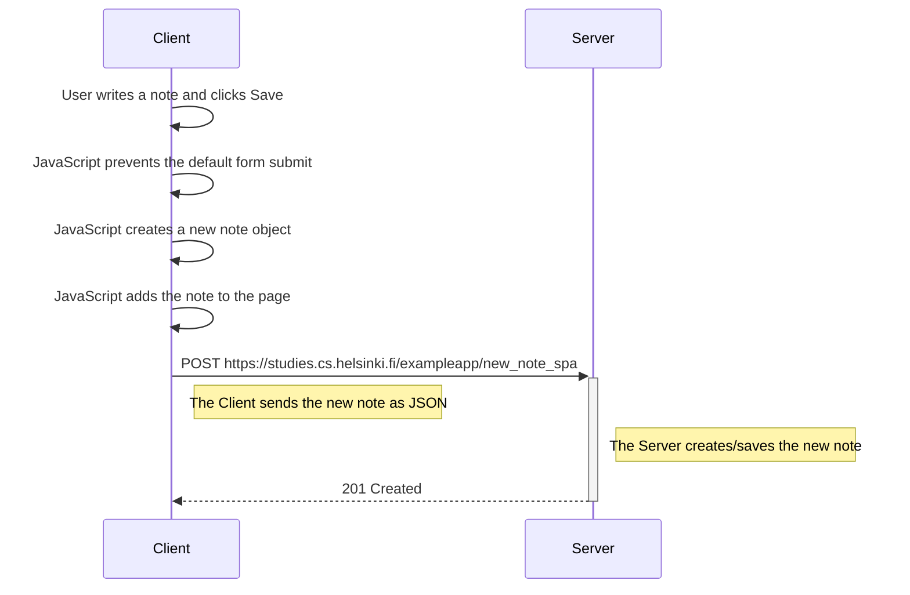

# 0.6 Uusi muistiinpano

```mermaid
sequenceDiagram
    Client->>Client: User writes a note and clicks Save
    Client->>Client: JavaScript prevents the default form submit
    Client->>Client: JavaScript creates a new note object
    Client->>Client: JavaScript adds the note to the page

    Client->>+Server: POST https://studies.cs.helsinki.fi/exampleapp/new_note_spa
    Note right of Client: The Client sends the new note as JSON
    Note right of Server: The Server creates/saves the new note
    Server-->>-Client: 201 Created
```
